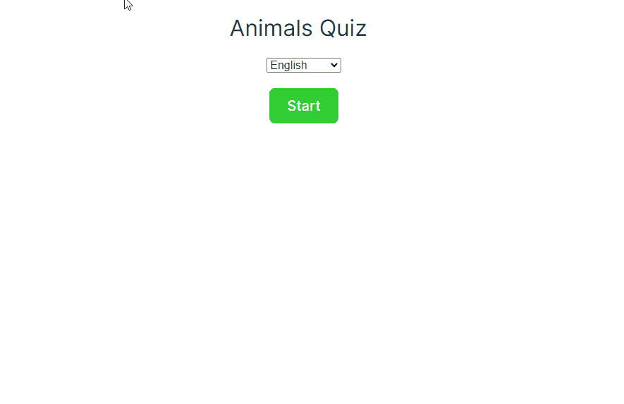

# Animal Quiz

This is the companion repository for the article: [Localizing Svelte Applications with Svelte-i18n and Crowdin](https://crowdin.com/blog/2024/03/12/svelte-localization)



This is a simple animal quiz built with Svelte. It contains general questions about animals, with five(5) questions per session. The quiz was localized into French using svelte-i18n and Crowdin.

## Running the Application Locally
Follow these steps to run the application in your local environment:
1. Clone the repository.
2. Navigate into the cloned folder.
```
cd animal-quiz
```
3. Install the dependencies.
```
npm install
```
4. Start the development server.
```
npm run dev
```
5. Visit the server's address in your browser.